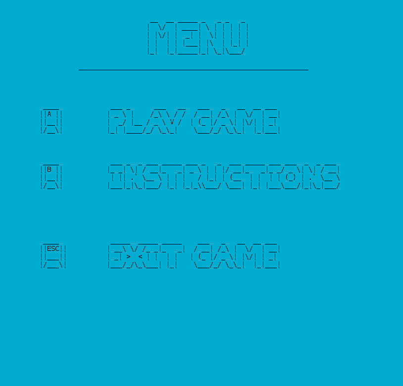
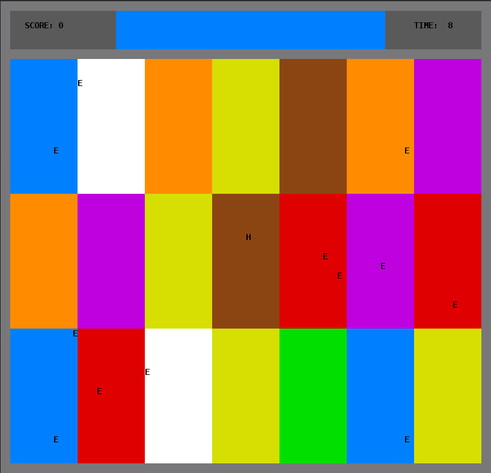
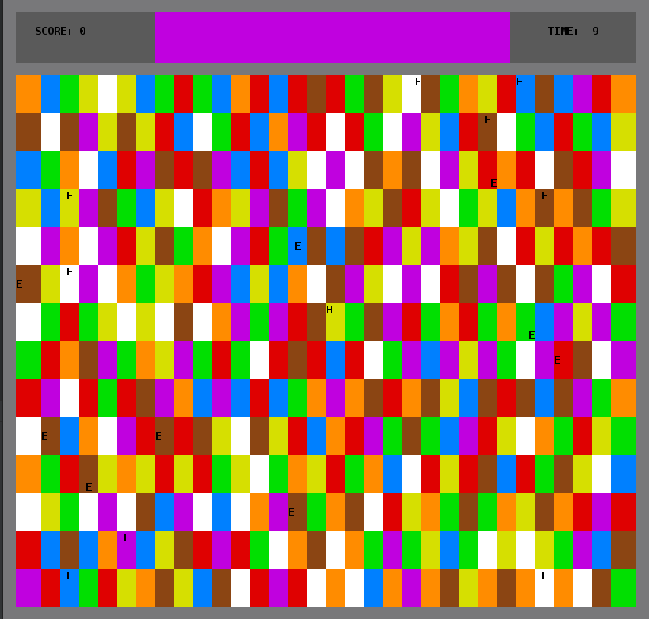
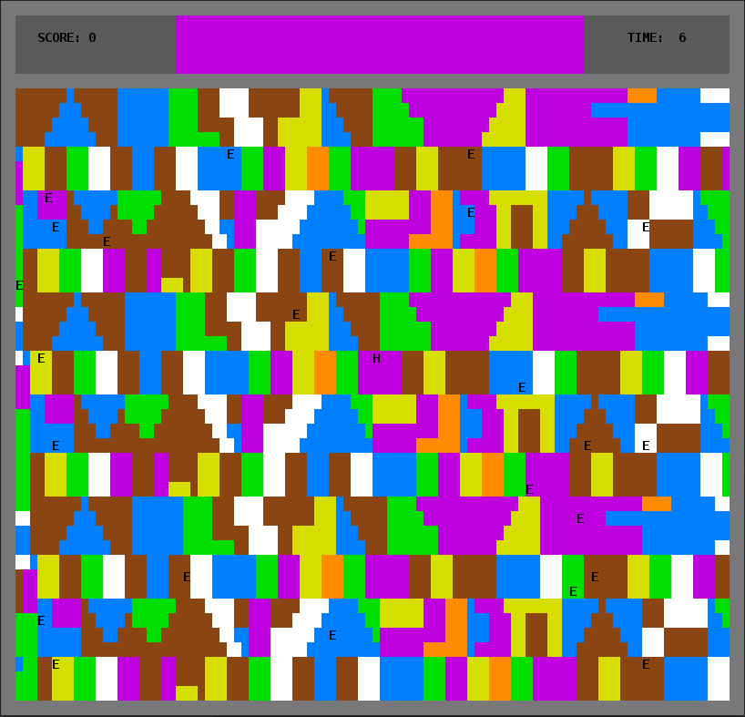

# COLOR PARTY

## Resumo do projeto
 
O nosso jogo tem o personagem controlado pelo utilizador através das setas do teclado e que se movimenta numa arena, dividida em várias regiões com diferentes cores. 

Na parte superior do ecrã existe uma barra onde mostramos a cor para a qual o herói se deve mover, o tempo restante que o jogador tem para completar cada fase e a pontuação atual do jogo.

O jogador tem de se dirigir para uma das regiões pintada com essa cor, antes do tempo acabar. Por cada fase concluída, é aumentada a sua pontuação em 1 ponto.

O jogo possuí 3 níveis: fácil, médio e difícil. No fácil, a arena é composta por grandes retângulos; no médio, a arena está dividida em retângulos menores; no difícil, é constituída por formas irregulares. As cores são distribuídas aleatoriamente pelos blocos.

Ao longo da arena existem também alguns "inimigos" espalhados, que se movem segundo 3 estratégias diferentes, dependendo do seu tipo.

Ao longo do projeto, aplicamos alguns Design Patterns, como o Observer, o Composite, o Strategy e o State e o projeto encontra-se estruturado segundo o padrão de arquitetura Model-View-Controller (MVC).

De seguida, apresentamos algumas imagens ilustrativas do nosso jogo.

|||
|:---------------------:|:------------------------:|
|Menu do jogo|Nível fácil|
|||
|Nível médio|Nível difícil|

## Demo do jogo

 ## Criadores

 * Paulo Ribeiro - up201806505 ([PJscp16](https://github.com/PJscp16))
  
 * Pedro Ferreira - up201806506 ([pdff2000](https://github.com/pdff2000))

 * Pedro Ponte - up201809694 ([pedrovponte](https://github.com/pedrovponte))
