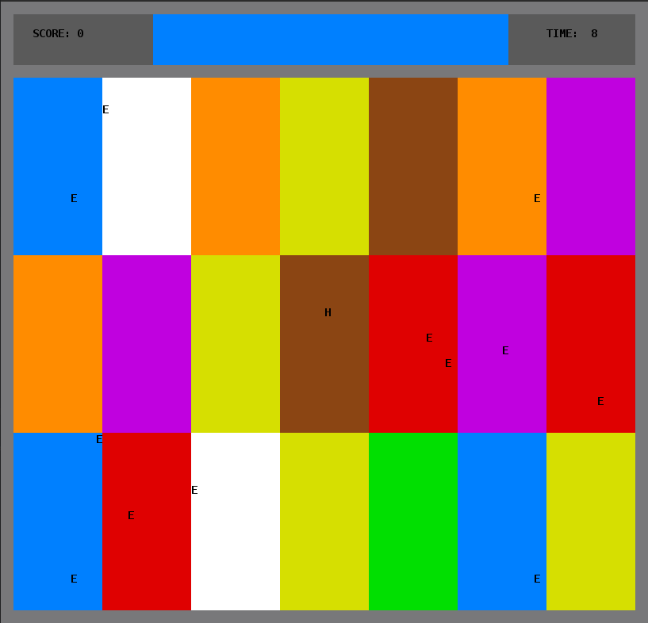
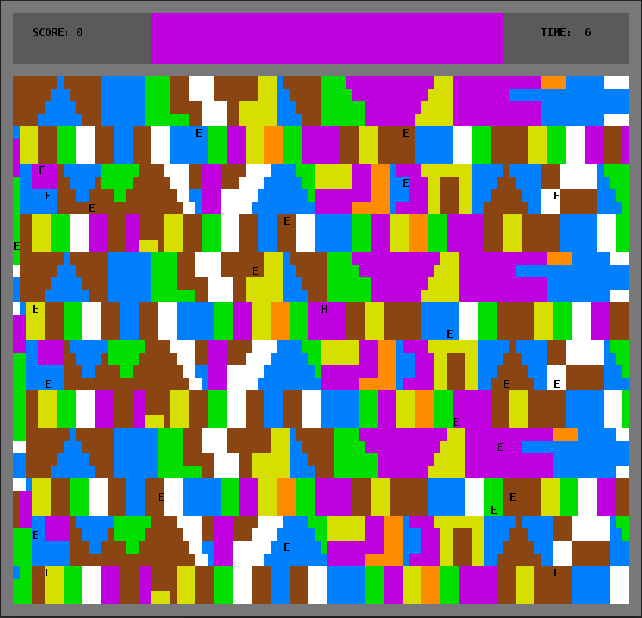

# LPOO_T3G5 - ColorParty

# Breve Descrição

ColorParty é um jogo em que o jogador é representado por um herói no ecrã (letra **H**), onde aparecem diversas áreas de diferentes cores. O ecrã subdivide-se na arena de jogo e numa área superior, onde irá ser apresentado um temporizador, a sua pontuação e uma cor.

O objetivo do jogo é que o herói se mova para uma das regiões com a cor representada nessa área, antes de o tempo acabar.

Após o término do tempo, se o jogador estiver na cor correta, a sua pontuação aumentará e passará a uma próxima fase, em que as cores da arena serão alteradas e será atribuída uma nova cor objetivo. Caso contrário, o jogo termina, ficando o jogador com a pontuação atual. O seu desempenho é também afetado por alguns inimigos espalhados pela arena (letra **E**), os quais o jogador deve evitar.

Este jogo foi desenvolvido pelos estudantes Paulo Ribeiro (up201806505@fe.up.pt), Pedro Ferreira (up201806506@fe.up.pt) e Pedro Ponte (up201809694@fe.up.pt) para LPOO 2019/20.

# Funcionalidades Implementadas

* Menu inicial, onde é possível escolher entre avançar para a escolha do nível, ver as instruções ou sair do jogo. Para tal utiliza-se as teclas **A**, **B** ou **ESC**;
* Menu onde se seleciona um dos 3 níveis do jogo: fácil, médio ou difícil, usando-se as teclas **A**, **B** ou **C**;
* O jogador move-se através das setas do teclado. Para sair do jogo, pode-se pressionar a tecla **Q**, aparecendo o ecrã de Game Over. Pressionando **ENTER**, retorna-se ao menu principal;
* Deteção de colisões entre o herói e os inimigos, sendo que quando tal acontece o jogo termina;
* Reconhecimento se a cor do bloco em que o jogador se encontra no momento em que o tempo termina corresponde à cor objetivo;
* Atribuição de um ponto sempre que o tempo termina e o jogador se encontra na cor certa;
* Arena dividida em várias regiões, com cores diferentes;
* Impossibilidade de duas regiões seguidas na mesma linha ou na mesma coluna terem a mesma cor (níveis fácil e médio);
* Uma área superior onde se mostra a cor do bloco para o qual o jogador se tem de mover (centro), a pontuação atual (lado esquerdo) e o tempo restante (lado direito);
* A cor na parte superior é alterada a cada 10 segundos (6 segundos no nível difícil), desde que o jogador esteja no bloco com a cor correta no final do tempo;
* A cor dos blocos da arena é também alterada sempre que o jogador avança no nível;
* Impossibilidade de aparecer uma cor inexistente na arena na barra superior;
* Aplicação dos design patterns adequados às situações: **Observer**, **Composite**, **Strategy** e **State** e o projeto encontra-se estruturado segundo o padrão de arquitetura **Model-View-Controller (MVC)**;
* Trabalhamos também na deteção de code smells, aplicando métodos de refactoring para os corrigir quando surgiram;
* Mapas dos vários níveis guardados em ficheiros de texto, que estão a ser lidos e manipulados quando se seleciona o nível (função [ReadFiles](../ColorParty/src/main/java/com/g35/files/ReadFiles.java));
* Vários inimigos espalhados pela arena, que condicionarão os movimentos do jogador, existindo 3 tipos de inimigos que se movem segundo estratégias diferentes: [Line Enemies](../ColorParty/src/main/java/com/g35/rules/LineEnemyController.java), [Follow Enemies](../ColorParty/src/main/java/com/g35/rules/FollowEnemyController.java) e [Random Enemies](../ColorParty/src/main/java/com/g35/rules/RandomEnemyController.java);
* Grande parte das funções implementadas estão testadas utilizando JUnit e Mockito.
* **Nota:** após a demonstração feita na aula, corrigimos um pequeno pormenor que nos tinha passado: quando estamos no ecrã de Game Over, quando se pressiona a tecla **Enter**, em vez de o jogo se [fechar](https://github.com/FEUP-LPOO/lpoo-2020-g35/blob/623cb94341bdc91552a4717e774b304da332b7f8/ColorParty/src/main/java/com/g35/states/GameOverState.java#L32), retorna ao [ecrã do Menu Principal](https://github.com/FEUP-LPOO/lpoo-2020-g35/blob/400cfe037f8df5197776c7dc762785e79d479cef/ColorParty/src/main/java/com/g35/states/GameOverState.java#L34). Devido à forma como o nosso código está estruturado, esta foi uma alteração muito fácil de se fazer, bastando alterar a chamada da função quando se avança no estado do Game Over ao pressionar o Enter.

De seguida apresentamos algumas imagens do ecrã de jogo, onde podemos ver o herói (letra **H**), os inimigos (letra **E**), as várias regiões da arena e a barra superior, onde aparece a cor para a qual o jogador se deve dirigir no centro, a pontuação atual no lado esquerdo e o tempo restante no lado direito.

|||
|:---------------------:|:------------------------:|
|Menu do jogo|Nível fácil|
|||
|Nível médio|Nível difícil|

# Funcionalidades Planeadas

No relatório intermédio, na secção das funções que poderíamos vir a implementar, referimos a possibilidade de o jogo vir a ser multijogador, utilizando-se para isso as telas WASD, e de poder haver obstáculos na arena, como por exemplo muros.

No entanto, por falta de tempo para implementar estas funcionalidades e depois testá-las devidamente, optamos por não as introduzir no nosso projeto.

# Demo

Apresentamos agora uma pequena demonstração do nosso jogo.

# Design

## Padrão de Arquitetura - Model-View-Controller (MVC)

### Contexto do problema

O primeiro problema que enfrentamos começou antes mesmo da escrita de código, uma vez que uma grande preocupação que tínhamos era a de o código chegar a tal ponto de desorganização que nos encontraríamos num "beco", sem volta a dar, pelo que procuramos desde cedo uma forma de gerir esta organização.

### Padrão de design aplicado

Chegamos então à conclusão de que deveríamos aplicar um Padrão de Arquitetura para fazer esta gestão, e optamos por aquele que mais aprofundamos nas aulas - o **Model-View-Controller (MVC)**. Este padrão é muito utilizado para o desenvolvimento de interfaces, pelo que é perfeitamente aplicável tendo em conta o nosso contexto. Resumidamente, divide a aplicação em três partes: **Model**, que apenas representa a informação (data); **View**, que apresenta no ecrã essa informação e manda informações para a terceira parte; **Controller**, que fornece a informação a mostrar à View, e interpreta as ações do utilizador.

### Implementação

Na figura seguinte apresenta-se o modelo genérico deste padrão. No nosso programa aplicámo-lo a classes distintas, destacando-se a Arena (ArenaModel, ArenaView, ArenaController).

A aplicação deste padrão pode ser observada através da organização do código em diferentes packages:

* [Controller (rules)](../ColorParty/src/main/java/com/g35/rules)
* [Model (data)](../ColorParty/src/main/java/com/g35/data)
* [View (gui)](../ColorParty/src/main/java/com/g35/gui)

### Consequências

Após termos desenvolvido algum código e estarmos já numa fase avançada em termos da estrutura do programa, podemos afirmar que o uso deste padrão facilitou bastante a organização do código e tornou bastante mais direta a navegação por este, uma vez que as classes estão divididas nessas três fases, sendo cada uma responsável por uma única tarefa, pelo que ajuda muito a cumprir  o **Single Responsibility Principle (SRP)**.

## Padrão Composite aplicado aos grupos de blocos

### Contexto do problema

Desde o início da nossa implementação procuramos discutir possíveis formas de gerir as alterações das cores e os blocos que compõem cada região colorida.

Cada uma das áreas coloridas é constituída por um conjunto de vários elementos mais pequenos da mesma cor, aos quais chamamos blocos unitários, constituindo-se assim um grupo de vários blocos com a mesma cor. Cada bloco unitário tem associado a sua posição (x,y) no ecrã e uma dada cor. Se na implementação do jogo tivéssemos de tratar individualmente cada um destes blocos, isso tornaria o código demasiado longo e seria muito maçador de programar.

### Padrão de design aplicado

Dadas as circunstâncias explicadas no ponto anterior, decidimos então aplicar o padrão de design **Composite**.

Aplicando este padrão, é possível agrupar os blocos unitários em grupos, que constituirão as regiões da arena às quais será atribuída uma dada cor a cada fase. Por sua vez, estes grupos poderão constituir um único bloco, que assim cobrirá toda a arena de jogo. Deste modo, a arena possuiria apenas um bloco.

Com a aplicação deste padrão, torna-se mais fácil gerir as várias regiões com a mesma cor, pois basta aplicar a cor ao grupo respetivo.

### Implementação

Na figura seguinte é mostrada a forma como este padrão se encontra aplicado no nosso projeto.

Estas classes podem ser encontradas nos seguintes ficheiros:

* [BlockComposite](../ColorParty/src/main/java/com/g35/data/BlockComposite.java)
* [BlockGroup](../ColorParty/src/main/java/com/g35/data/BlockGroup.java)
* [BlockModel](../ColorParty/src/main/java/com/g35/data/BlockModel.java)

### Consequências

O uso deste padrão revelou-se bastante útil tendo em conta o contexto do nosso jogo, pois permitiu tornar simples a arena, que numa primeira vista seria algo muito complexo, devido à enorme quantidade de blocos que a compõem. Permitiu-nos assim considerar que tem um só BlockComposite, o que tornou mais fácil a gestão das alterações das cores de cada bloco, a cada fase que passa.

## Padrão Observer - Notificações de Updates

### Contexto do problema

À medida que fomos desenvolvendo o código, fomos reparando que as nossas classes View e Controller se estavam a tornar demasiado complexas e responsáveis por toda a lógica do jogo, sendo que todas as outras classes dependiam destas. Havia portanto muita dependência entre as classes, e o "mecanismo" do jogo começava a ficar muito concentrado nestas classes.

### Padrão de design aplicado

A solução que encontramos para evitar esta dependência de classes consiste no uso do padrão de design **Observer**.

A alteração de um objeto implicava mudar outros. Por exemplo, caso a posição do HeroModel fosse alterada, teríamos que notificar o ElementView desta alteração, para que fosse apresentado no ecrã a posição correta do Hero. Por outro lado, o HeroModel deveria ser também capaz de notificar o ElementView sem possuir quaisquer conhecimentos desta classe. Ora, estas são aplicabilidades do padrão de design Observer, pelo que este é a melhor opção para este problema. Recorremos até a uma variação deste padrão, que consiste em observar mais do que um objeto, o que necessitamos no BlockView, que deveria ser o Observer de todos os blocos da arena de jogo (BlockModel). Este será notificado sempre que um bloco mudar de cor.

### Implementação

No nosso programa aplicámo-lo a classes distintas, destacando-se a Arena (ArenaView é o Observer de ArenaModel), o Element (ElementView é o Observer de ElementModel) e o Block (BlockView é o Observer de todos os BlockModels que compõem a arena de jogo).

Na figura seguinte é mostrada a aplicação deste padrão ao caso dos Blocks. Neste caso, o notify chamado pelo BlockModel é efetuado na função changeColor().

Estas classes podem ser encontradas nos seguintes ficheiros:

* [Observer](../ColorParty/src/main/java/com/g35/observer/Observer.java)
* [Observable](../ColorParty/src/main/java/com/g35/observer/Observable.java)
* [ArenaView](../ColorParty/src/main/java/com/g35/gui/ArenaView.java)
* [ArenaModel](../ColorParty/src/main/java/com/g35/data/ArenaModel.java)
* [ElementModel](../ColorParty/src/main/java/com/g35/data/ElementModel.java)
* [BlockView](../ColorParty/src/main/java/com/g35/gui/BlockView.java)
* [BlockModel](../ColorParty/src/main/java/com/g35/data/BlockModel.java)

### Consequências

O uso deste padrão torna abstrata a relação entre o objeto que é observado e o observador, o que remove a forte dependência que estava antes presente entre estas classes. Permite-nos também adicionar facilmente novos observadores, que precisem de saber quando acontece um dado evento. Este padrão traz consigo um único problema, que se deve ao facto de o número de parâmetros passados aos observadores ser limitado, o que nos levou a pensar em outras formas de recorrer a informação que precisássemos, mas que não seria fornecida pelos *notify()*. Porém, este problema é um mal necessário, tendo em conta a importância de mantermos a independência entre as várias classes do nosso programa.

## Padrão Strategy - Estratégias de Movimento dos Inimigos

### Contexto do problema

Logo após adicionarmos alguns inimigos e implementarmos o funcionamento correto da verificação da cor do bloco em que o Hero se encontrava após um dado tempo, o nosso programa começava de facto a funcionar como um "jogo". No entanto, mostrava-se pouco desafiante tendo em conta a facilidade de nos desviarmos dos inimigos e chegarmos à cor correta sem grandes preocupações.
Para complicar um pouco o jogo, surgiu-nos a ideia de melhorar os movimentos dos inimigos, de modo a estes passarem a ter peso na atenção requerida pelo jogador.

### Padrão de design aplicado

Concluímos então que seria o momento perfeito para recorrer ao padrão de design **Strategy**.

Deste modo, poderíamos aplicar diferentes estratégias de movimento para os diferentes inimigos, e estes tornar-se-iam menos previsíveis.

Adicionamos então, recorrendo a este padrão de design, três estratégias diferentes de movimento para os inimigos:

* A mais simples corresponde ao movimento dos inimigos do tipo [RandomEnemyModel](../ColorParty/src/main/java/com/g35/data/RandomEnemyModel.java), que a cada movimento escolhem um sentido aleatório;

* A segunda, referente aos inimigos do tipo [LineEnemyModel](../ColorParty/src/main/java/com/g35/data/LineEnemyModel.java), consiste também em escolher um sentido aleatório, no qual são percorridos cinco blocos seguidos nesse sentido, e não um único como no caso anterior;

* A última, que se trata da mais desafiante, é atribuída aos inimigos do tipo [FollowEnemyModel](../ColorParty/src/main/java/com/g35/data/FollowEnemyModel.java), que se deslocam sempre no sentido mais próximo do Hero, ou seja, perseguem o Hero, tornando-se uma preocupação constante para o jogador.

### Implementação

Como já referido acima, foi necessário criar três tipos de inimigos diferentes e, consequentemente, três controladores destes: [RandomEnemyController](../ColorParty/src/main/java/com/g35/rules/RandomEnemyController.java), [LineEnemyController](../ColorParty/src/main/java/com/g35/rules/LineEnemyController.java) e [FollowEnemyController](../ColorParty/src/main/java/com/g35/rules/FollowEnemyController.java). Todos estes herdam uma classe abstrata, o EnemyController, com o método *moveEnemy()* chamado no [ArenaController](../ColorParty/src/main/java/com/g35/rules/ArenaController.java#L71), quando for necessário o movimento de um inimigo.

Na figura seguinte é mostrada a aplicação deste padrão neste contexto. Neste caso, o *moveEnemy()* é o método em comum, que aplica a estratégia de movimento desejada.

Estas classes podem ser encontradas nos seguintes ficheiros:

* [ArenaController](../ColorParty/src/main/java/com/g35/rules/ArenaController.java)
* [EnemyController](../ColorParty/src/main/java/com/g35/rules/EnemyController.java)
* [RandomEnemyController](../ColorParty/src/main/java/com/g35/rules/RandomEnemyController.java)
* [LineEnemyController](../ColorParty/src/main/java/com/g35/rules/LineEnemyController.java)
* [FollowEnemyController](../ColorParty/src/main/java/com/g35/rules/FollowEnemyController.java)

### Consequências

A aplicação deste padrão permitiu-nos alcançar o nosso objetivo (tornar o jogo mais desafiante) de forma simples. A implementação de novas estratégias de movimento é agora muito mais concretizável, tendo em conta que basta criar uma nova subclasse que derive da classe [EnemyController](../ColorParty/src/main/java/com/g35/rules/EnemyController.java) e que implemente os métodos abstratos desta, nomeadamente o moveEnemy().

## Padrão State - Visualização de Menus

### Contexto do problema

A partir do momento em que o nosso programa se tornou "jogável", notou-se a necessidade clara de introdução de um sistema navegação e escolha das funcionalidades implementadas no código. Estes menus que seriam adicionados permitir-nos-iam a escolha da dificuldade do nível, a visualização de uma página com instruções e um menu "Game Over", indicando o final do jogo.

### Padrão de design aplicado

Para satisfazer as nossas necessidades, concluímos que o melhor padrão de design a ser aplicado seria o **State**.

Assim, a mudança entre menus seria controlada pelo comportamento de um objeto state que controlaria o que seria visualizado no ecrã. Deste modo, existiriam cinco interfaces diferentes e, consequentemente cinco states diferentes:

* O state que aparece inicialmente quando a aplicação é iniciada é o [MenuState](../ColorParty/src/main/java/com/g35/states/MenuState.java), que apresenta a possibilidade de mudança para dois novos states, sendo eles a página de instruções e o menu de escolha de dificuldade e inicialização do jogo;

* O menu relacionado com o state [InstructionsState](../ColorParty/src/main/java/com/g35/states/InstructionsState.java) permite a visualização das regras e funcionamento do jogo, quando ativado;

* No state [ChooseModeState](../ColorParty/src/main/java/com/g35/states/ChooseModeState.java) surge a possibilidade de escolha da dificuldade do jogo, variando entre fácil, médio e difícil;

* Após a seleção da dificuldade, o valor do objeto state passa a ser [GameState](../ColorParty/src/main/java/com/g35/states/GameState.java). Este será o state principal da aplicação, sendo aquele que informa o programa que o jogo em si, deve ser inicializado com a dificuldade selecionada anteriormente;

* Por fim, deparamo-nos com o último state disponível, sendo ele o [GameOverState](../ColorParty/src/main/java/com/g35/states/GameOverState.java). Este state é ativado quando o jogo termina, ou porque o jogador não se encontrava na cor correta quando o tempo terminou, ou porque a tecla **Q** foi pressionada ou então o jogador foi "apanhado" por um inimigo.

### Implementação

Para a aplicação deste padrão de design, foi necessária a inclusão de um controller: [GameController](../ColorParty/src/main/java/com/g35/rules/GameController.java). Este controller apresenta como objetos da classe o ecrã da aplicação e um objeto [State](../ColorParty/src/main/java/com/g35/states/State.java). Este último corresponde a uma classe abstrata que herdará os cinco diferentes States abordados no parágrafo anterior. 

Na figura seguinte é mostrada a aplicação deste padrão neste contexto. Os métodos em comum a cada State serão o método *init()* e o método *doStep()*, responsáveis pela inicialização do State e pela realização da ação a ele destinada, respetivamente.

Apresenta-se de seguida um esquema do funcionamento deste padrão conforme os inputs do utilizador, que ilustra as mudanças de estados implementadas.

Estas classes podem ser encontradas nos seguintes ficheiros:

* [GameController](../ColorParty/src/main/java/com/g35/rules/GameController.java)
* [State](../ColorParty/src/main/java/com/g35/states/State.java)
* [MenuState](../ColorParty/src/main/java/com/g35/states/MenuState.java)
* [InstructionsState](../ColorParty/src/main/java/com/g35/states/InstructionsState.java)
* [ChooseModeState](../ColorParty/src/main/java/com/g35/states/ChooseModeState.java)
* [GameState](../ColorParty/src/main/java/com/g35/states/GameState.java)
* [GameOverState](../ColorParty/src/main/java/com/g35/states/GameOverState.java)

### Consequências

Com a aplicação deste padrão, a nossa aplicação passou a apresentar uma interface simples e eficiente que permite a seleção das implementações previamente aplicadas. Deste modo, com a simples implementação de uma subclasse [State](../ColorParty/src/main/java/com/g35/States/State.java), podemos adicionar novos estados ao programa, sendo a implementação de novos menus e funcionalidades independentes de outros criados previamente.

# Code smells e possíveis refactorings

## Duplicate Code

Num momento anterior, o código possuía classes muito similares, nomeadamente as classes [EnemyModel](https://github.com/FEUP-LPOO/lpoo-2020-g35/blob/6fc9751c4e4061d812746f7461713eb619f6dd13/ColorParty/src/main/java/data/EnemyModel.java) e [HeroModel](https://github.com/FEUP-LPOO/lpoo-2020-g35/blob/6fc9751c4e4061d812746f7461713eb619f6dd13/ColorParty/src/main/java/data/HeroModel.java), [EnemyView](https://github.com/FEUP-LPOO/lpoo-2020-g35/blob/6fc9751c4e4061d812746f7461713eb619f6dd13/ColorParty/src/main/java/gui/EnemyView.java) e [HeroView](https://github.com/FEUP-LPOO/lpoo-2020-g35/blob/6fc9751c4e4061d812746f7461713eb619f6dd13/ColorParty/src/main/java/gui/HeroView.java). Estas continham muito **código duplicado** e métodos semelhantes, só variando entre se aplicar ao herói ou ao inimigo. Isto trazia alguns problemas pois tornvaa a estrutura do código mais complexa, com várias classes semelhantes e com bastantes mais linhas de código, tornando-se o código repetitivo e mais maçador.

O herói e os inimigos são elementos que têm bastantes coisas em comum no jogo, pois ambos têm movimento, ocupam uma determinada posição na arena a cada momento, têm observadores, entre outros elementos em comum.

Assim, a solução para corrigir este problema foi criar uma superclasse para cada par destas classes ([ElementModel](../ColorParty/src/main/java/com/g35/data/ElementModel.java) e [ElementView](../ColorParty/src/main/java/com/g35/gui/ElementView.java)), movendo os métodos partilhados para esta superclasse. De seguida, as classes extendem esta nova superclasse ([HeroModel](../ColorParty/src/main/java/com/g35/data/HeroModel.java) e [EnemyModel](../ColorParty/src/main/java/com/g35/data/EnemyModel.java)) que contém os métodos comuns. Desta forma, evita-se a duplicação de código desnecessária e o código torna-se mais simples.

## Large Class

O principal sintoma deste Code Smell é o facto de uma classe ter muitos atributos, métodos ou linhas de código. No nosso código, estava presente na classe [ArenaView](https://github.com/FEUP-LPOO/lpoo-2020-g35/blob/e00dee811efa1d4a809d201ca24c134b7d0d75a0/ColorParty/src/main/java/gui/ArenaView.java), pois esta continha vários atributos referentes à interface do Lanterna. Isto devia-se também ao facto de, no momento da primeira entrega, ainda só termos implementado um modo (fácil), que era gerido por esta classe. Ao longo do tempo fomos reduzindo o código desta classe, e neste momento consideramos que se encontra o [mais reduzido possível](../ColorParty/src/main/java/com/g35/gui/ArenaView.java), controlando apenas a parte visual do jogo, dependendo do modo (fácil, médio ou difícil).

A sugestão de Refactoring que demos na primeira entrega consistia na aplicação do **Extract Class**, pois considerávamos necessário criar uma classe abstrata que contivesse estes atributos, comuns a todos os modos (por exemplo, o screen, o graphics ou os limites da arena). Ora, este não chegou a ser aplicado, pois a implementação do padrão de design State permitiu mover estes atributos, pelo que a ArenaView deixou de ter responsabilidades em excesso, recebendo os atributos necessários como parâmetro do seu construtor, chamado no método *init()* da classe [GameState](../ColorParty/src/main/java/com/g35/states/GameState.java#L21), que por sua vez é chamado no método *changeToGameState()* da classe [GameController](../ColorParty/src/main/java/com/g35/rules/GameController.java#L36).

Por outro lado, a implementação destes três modos levou a um aumento progressivo da classe [ArenaController](../ColorParty/src/main/java/com/g35/rules/ArenaController.java), uma vez que esta é responsável pela gestão do comportamento do jogo, que depende do modo em execução. Apesar da sua complexidade, consideramos que não é complicada de entender, e que a aplicação de refactorings levaria a uma maior separação do código, e como consideramos que a gestão do comportamento do jogo deve permanecer junta, para facilitar o seu entendimento, decidimos manter este code smell.

## Data Class

Uma Data Class refere-se a uma classe que contém apenas atributos e métodos para acesso a estes (getters e setters). Estas classes não contêm qualquer funcionalidade adicional e a sua única função é armazenar a informação usada por outras classes. Ora, no nosso programa, este é um problema difícil de evitar, uma vez que seguimos o padrão de arquitetura MVC, estando a divisão das classes em Model inerente a este padrão. Portanto, todas as classes do package [data](../ColorParty/src/main/java/com/g35/data) (as classes Model) serão consideradas Data Classes.

Por este motivo, decidimos não aplicar quaisquer refactorings a este Code Smell, para que se cumpra o modelo arquitetural MVC, pois acabariam por tornar o código ainda mais complexo.

## Dead Code

Este Code Smell está presente quando uma variável, parâmetro, atributo, método ou classe já não é mais usada. Ora, uma vez que, na primeira entrega, nos encontrávamos ainda numa fase inicial do projeto, tínhamos algum Dead Code espalhado pelo programa, que resultou de alternativas a certos problemas que encontramos, que depois acabaram por cair em desuso, visto que encontramos uma melhor solução para esses problemas. Por exemplo, na classe **ElementView**, tínhamos um atributo [previousPosition](https://github.com/FEUP-LPOO/lpoo-2020-g35/blob/7af522002e51fecf5b53b40c078b757b160798e0/ColorParty/src/main/java/com/g35/gui/ElementView.java#L15) que deixou de ser usado, que resultou de tentativas de corrigir o problema de limpar o herói e os inimigos do ecrã, após novo movimento destes. No entanto, acabamos por arranjar melhores soluções recorrendo aos *notify()* permitidos pelo padrão Observer, sendo este problema resolvido no [ArenaController](../ColorParty/src/main/java/com/g35/rules/ArenaController.java).

Já numa fase final do projeto, eliminamos a maior parte do Dead Code que o código possuía, de forma a eliminarmos este code smell e a tornar o código mais limpo, como por exemplo este existente na classe [ArenaView](https://github.com/FEUP-LPOO/lpoo-2020-g35/blob/3add0824493b23f59807c9106b9378e647da950b/ColorParty/src/main/java/com/g35/gui/ArenaView.java#L68)

## Inappropriate Intimacy

Este Code Smell consiste no uso de atributos/métodos privados de uma classe por outra classe. Este problema surge, por exemplo, no caso da lista [limits](../ColorParty/src/main/java/com/g35/gui/ArenaView.java#L133), que contém os BlockModel que compõem os limites da arena de jogo, e que são usados pelas classes [HeroController](../ColorParty/src/main/java/com/g35/rules/HeroController.java#L37) e [EnemyController](../ColorParty/src/main/java/com/g35/rules/EnemyController.java#L20), para detetar colisões com estes limites.

Manteve-se este code smell, uma vez que este atributo precisa de ser utilizado em diferentes funções do código, de diferentes componentes do MVC: é utilizado pelos Controllers referidos acima para deteção de colisões, impedindo o Hero e os Enemies de atravessarem os limites da arena, e é também utilizado pela classe [ArenaView](../ColorParty/src/main/java/com/g35/gui/ArenaView.java#L119), para serem efetivamente desenhados no ecrã.

## Switch Statements

Quando o código possui uma sequência de ifs complexa, ou um switch complexo, dizemos que estamos perante este code smell. Um caso bastante explícito deste code smell no nosso código ocorreu na classe [TimeView](https://github.com/FEUP-LPOO/lpoo-2020-g35/blob/63466e939a82819d6aa583f5c386fa832247c2f0/ColorParty/src/main/java/gui/TimeView.java#L61), num momento em que ainda não tinhamos implementado o tempo, e portanto, o Time era contabilizado com o número de movimentos do Hero.

A solução que arranjamos para lidar com este code smell consistiu em encontrar uma fórmula genérica que devolvesse o número a apresentar no ecrã consoante o número de movimentos do Hero. Desta forma, simplificamos o código e vimo-nos livres deste problema, como podemos ver [aqui](https://github.com/FEUP-LPOO/lpoo-2020-g35/blob/877c23072baa0abe6b13587e50d724c16a81fbcd/ColorParty/src/main/java/gui/TimeView.java).

De resto, as únicas cadeias de ifs complexas do programa são as presentes nas funções semelhantes à *getCommand()* da classe [ArenaController](../ColorParty/src/main/java/com/g35/rules/ArenaController.java#L87), que trata das leituras de input do utilizador. Como é necessário recolher todos os casos de teclas com significado para o jogo, este code smell é um mal necessário, de forma a tomar comportamentos diferentes conforme as teclas premidas.

## Long Method

Este code smell está presente quando um método de uma classe se torna muito longo, ou seja, contém muitas linhas de código. Era exatamente este o problema que estava a acontecer na classe ArenaModel, mais concretamente na função [createEnemies](https://github.com/FEUP-LPOO/lpoo-2020-g35/blob/ba12922ab6dd3616b70ae2932cbaee11d18baf11/ColorParty/src/main/java/com/g35/data/ArenaModel.java#L69).

Inicialmente, como só existia um tipo de inimigos, esta era uma função muito simples, como se pode visualizar [aqui](https://github.com/FEUP-LPOO/lpoo-2020-g35/blob/4b7a0e794632c23d76f329cc411b1a32b7674f25/ColorParty/src/main/java/com/g35/data/ArenaModel.java#L48). No entanto, depois de implementarmos várias estratégias para a movimentação dos inimigos, esta função passou a ser bastante extensa, pois para além de criar todos os tipos de inimigos, a quantidade destes ainda varia de acordo com o nível selecionado.

Para solucionar este problema, decidimos aplicar a técnica **Extract Method**, que consiste em mover esta parte do código para um novo método e substituir o código na função antiga por uma chamada a esta nova função. No nosso caso específico, aplicamos este método 3 vezes, tantas quanto os tipos de inimigos existentes. Assim, dividimos a função original em 3 novas e [substituímos](../ColorParty/src/main/java/com/g35/data/ArenaModel.java#L69) o código antigo por chamadas a estas 3 novas funções: [createRandomEnemies](../ColorParty/src/main/java/com/g35/data/ArenaModel.java#L77), [createFollowEnemies](../ColorParty/src/main/java/com/g35/data/ArenaModel.java#L97) e [createLineEnemies](../ColorParty/src/main/java/com/g35/data/ArenaModel.java#L135).

# Teste das funcionalidades

Para testar as funções implementadas, utilizamos JUnit e Mockito.

Todas as funções de teste implementadas encontram-se no diretório [Test](../ColorParty/src/test/java/com/g35).

De seguida, apresentamos uma imagem com as percentagens de cobertura dos testes sobre o código.

Os relatórios dos testes de cobertura para cada classe da aplicação podem ser vistos [aqui](./Tests/CoverageTests).

Apresentamos também uma imagem com as percentagens de cobertura de mutações quando recorremos aos **Pitest**. Os relatórios podem ser vistos [aqui](./Tests/Pitests).

# Autoavaliação

O desenvolvimento de código e do relatório foi dividido de forma igual pelos 3 membros do grupo.

Para além de cada membro desenvolver funcionalidades do jogo de forma individual, seguindo uma divisão de tarefas previamente definida, também nos reunimos virtualmente para, em conjunto, implementarmos aquelas que consideramos partes fundamentais da aplicação. Desta forma, todos ficamos a perceber facilmente como estas funções estão desenvolvidas, tornando-se mais fácil a restante implementação de forma individual.

* Paulo Ribeiro: 33,33%

* Pedro Ferreira: 33,33%

* Pedro Ponte: 33,33%
